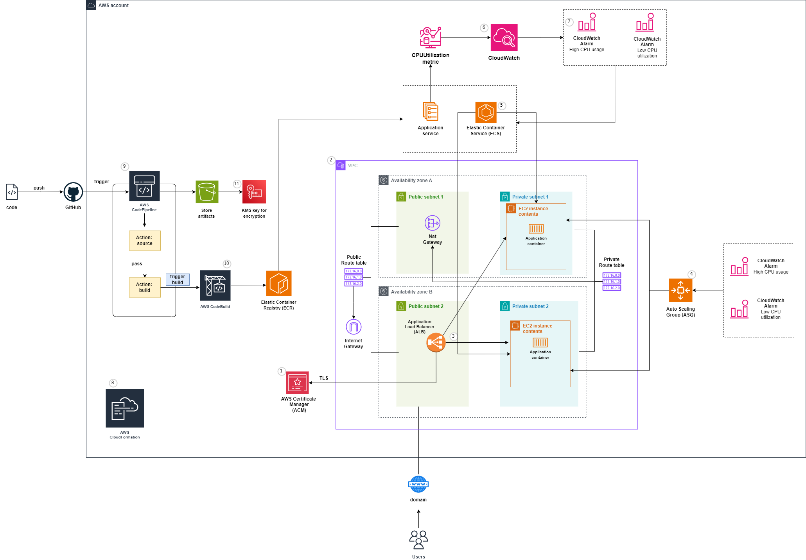

# Scalable and Highly Available Infrastructure on AWS

**Undergraduate Final Project**

Instituto Federal Fluminense (IFF) – Campus Itaperuna  
Bachelor's Degree in Information Systems

## About the Project

This repository contains the implementation developed for an undergraduate thesis focused on scalable and highly available infrastructure on AWS.

The solution leverages AWS services to automatically provision a container-based architecture featuring load balancing, automatic scaling, monitoring, and a Continuous Integration and Continuous Delivery (CI/CD) pipeline.

## Architecture



## Technologies

- AWS CloudFormation
- Amazon VPC
- Application Load Balancer (ALB)
- Amazon ECS
- Auto Scaling Groups
- Amazon ECR
- AWS CodeBuild
- AWS CodePipeline
- Amazon CloudWatch
- Docker
- Flask

## Features

- Infrastructure as Code (IaC) using CloudFormation
- Load balancing with Application Load Balancer
- Automatic scaling using Auto Scaling Groups
- Containerized application with Docker
- Container image storage in Amazon ECR
- Application orchestration with Amazon ECS
- Automated CI/CD pipeline
- Monitoring with Amazon CloudWatch

## Repository Structure

```text
aws-scalable-infrastructure/
  README.md                         # Project documentation (Portuguese)
  README_EN.md                      # Project documentation (English)
  app/                              # Flask application source code
    app.py
    Dockerfile
    requirements.txt
    static/
      style.css
  iac/
    buildspec/
      buildspec.yaml
    cloudformation/
      main.yaml
      vpc.yaml
      alb.yaml
      asg.yaml
      ecs.yaml
      cicd.yaml
      cloudwatch.yaml
  docs/
    arquitetura.png                 # Architecture diagram
    images/                         # Implementation screenshots
    implementation.md               # Implementation details
```

## Running Locally (Development)

Prerequisites: Docker and Git.

1. Clone the repository and navigate to the project directory:

```powershell
git clone <REPOSITORY_URL>
cd aws-scalable-infrastructure
```

2. Run the application using Docker:

```powershell
cd app
docker build -t flask-app .
docker run -p 8080:80 flask-app

# Access:
http://localhost:8080
```

3. Or run the application without containers (EC2 metadata requests will fail locally):

```powershell
python -m venv .venv
.\.venv\Scripts\Activate
pip install -r app/requirements.txt
python app/app.py

# Access:
http://localhost:80
```

## AWS Deployment (CloudFormation)

Infrastructure templates are located in `iac/cloudformation/` and are organized as nested stacks. The main template (`main.yaml`) references the remaining templates stored in an Amazon S3 bucket through the `TemplateURL` property.

In this implementation, all templates were uploaded to an S3 bucket and deployed through the main template.

Deployment procedure (AWS Console):

1. Open the AWS CloudFormation console.
2. Click **Create stack** → **With new resources (standard)**.
3. Under **Upload a template file**, upload the `main.yaml` template.
4. Click **Next** and specify the stack details:
   - Stack name (for example, `FlaskApplication`)
   - Required parameters such as `ProjectName`, `GitHubv2ConnectionArn`, `ACMCertificateArn`, `EcsImage`, and `EcsMinTasksNumber`
5. Continue to the review page and acknowledge the required capabilities (for example, IAM resource creation).
6. Click **Create stack**.

CloudFormation will create the main stack and automatically provision all referenced nested stacks.

Post-deployment verification:

- Review the **Events** tab to monitor deployment progress and identify errors.
- Check the **Outputs** tab for exported values such as ALB DNS names, ARNs, and resource identifiers.
- Verify that dependent resources have been successfully created (ECR repository, ECS cluster and service, Auto Scaling Group, ALB, S3 artifacts, CodeBuild, and CodePipeline).

Example deployment using the AWS CLI:

```powershell
aws cloudformation create-stack \
  --stack-name FlaskApplication \
  --template-url https://s3.amazonaws.com/YOUR_BUCKET/main.yaml \
  --capabilities CAPABILITY_IAM \
  --parameters ParameterKey=ProjectName,ParameterValue=my-project
```

## CI/CD

The CI/CD pipeline is defined in `iac/buildspec/buildspec.yaml` and relies on parameters and environment variables such as ECR repository names, ECS cluster information, and a GitHub connection (GitHub v2 Connection ARN).

The pipeline performs the following actions:

- Build Docker images
- Push images to Amazon ECR
- Trigger ECS service deployments

## Implementation Details

See [`docs/implementation.md`](docs/implementation.md) for a detailed description of the implementation process, including screenshots and deployment evidence.

## Documentation

- Architecture Diagram: `docs/arquitetura.png`
- Implementation Details: `docs/implementation.md`

## Author

Maria Eduarda Lopes Maldonado

## Supervisor

Prof. Francisco Alves de Freitas Neto, M.Sc.

---